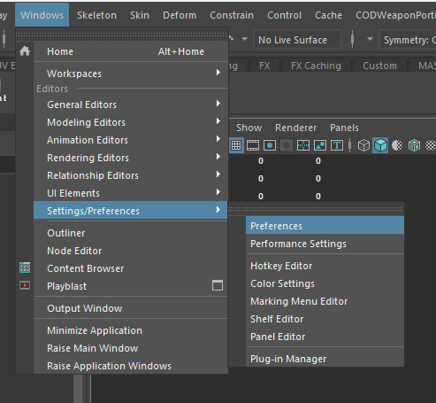
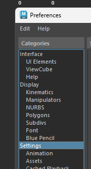
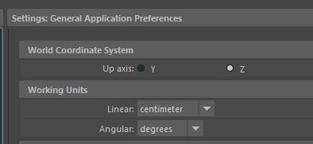
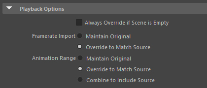
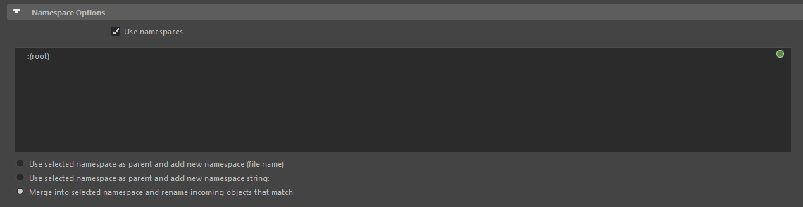
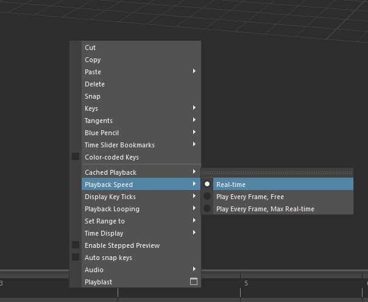
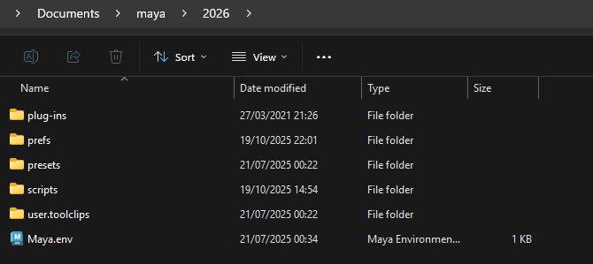
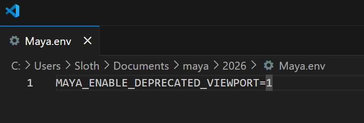
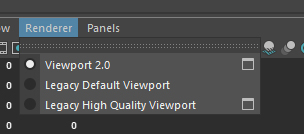

# Tools/porgrams

A list of tools and programs you will need to port weapons from all COD games!

Click on the tool/porgram in the list below to downlow them.

- AutoDesk Maya (2023+)
- [Saluki](https://github.com/echo000/saluki-releases/releases)
- [Cordycep](https://github.com/Scobalula/Cordycep/releases)
- [CODMayaTools](https://github.com/ManyAsset/CODMayaTools/releases)
- [Cast](https://github.com/dtzxporter/cast/releases)
- [ManyAnims](https://github.com/ManyAsset/ManyAnims/releases)
- [GameImageUtil (GIU)](https://github.com/Scobalula/GameImageUtil/releases)
- [COD4:MW ModTools](https://github.com/ManyAsset/cod4mw-modtools/releases) 
- [ManyWeapons](https://github.com/ManyAsset/ManyWeapons/releases)
- [HydraX](https://github.com/Scobalula/HydraX/releases)

## Setting Up Maya!
How to set up Maya ready to port weapons.

### Up axis {Up-axis}

- First head to the windows tab at the top, then "Settings/Preferences" > "Preferences".

- Click on "Settings".

- Select up axis: Z.

##

### Import settings

- Go to the file tab top left, then click on the box next to "Import...".

- Look for playback options and select "Override to Match Source" for both "Framerate Import" and "Animation Range".

- At the bottom of the window you should see "Namespace options", select "Merge into selected namespace and rename imcoming objects that match".

##

### Timeline speed

- Right click your timeline at the bottom of your screen, head to "Playback Speed" > "Real-time".

##

### Enable "Viewport 2.0"

- Head to your maya folder located in your douments folder e.g `Documents\maya\2026`, there you should see a file called
"Maya.env" open it with any text editor *(notepad, np++, VS code)*.

- Once there copy this into to the file and save `MAYA_ENABLE_DEPRECATED_VIEWPORT=1`.

- Restart Maya if you have it open, after restarting you should see a setting called "Legacy Default Viewport" in Renderer.

## Setting Up CODMayaTools

How to install CODMayaTools!

## Setting Up Cast

How to install Cast!

## Setting Up ManyAnims

How to install ManyAnims!

## Using Saluki

How to use Saluki!

## Using Cordycep

How to use Cordycep!

## Using GameImageUtil (GIU)

How to use GameImageUtil (GIU)!

## Installing COD4:MW ModTools

How to install COD4:MW ModTools!

## Using ManyWeapons

How to use ManyWeapons!

## Using HydraX

How to use HydraX!

