# Tools/porgrams

A list of tools and programs you will need to port weapons from all COD games!

Click on the tool/porgram in the list below to downlow them.

- AutoDesk Maya (2023+)
- [Saluki](https://github.com/echo000/saluki-releases/releases)
- [Cordycep](https://github.com/Scobalula/Cordycep/releases)
- [CODMayaTools](https://github.com/ManyAsset/CODMayaTools/releases)
- [Cast](https://github.com/dtzxporter/cast/releases)
- [ManyAnims](https://github.com/ManyAsset/ManyAnims/releases)
- [GameImageUtil (GIU)](https://github.com/Scobalula/GameImageUtil/releases)
- [COD4:MW ModTools](https://github.com/ManyAsset/cod4mw-modtools/releases) 
- [ManyWeapons](https://github.com/ManyAsset/ManyWeapons/releases)
- [HydraX](https://github.com/Scobalula/HydraX/releases)

## Setting Up Maya!
How to set up Maya ready to port weapons.

### Up axis

How to set-up up axis

- First head to the windows tab at the top, then "Settings/Preferences" > "Preferences".

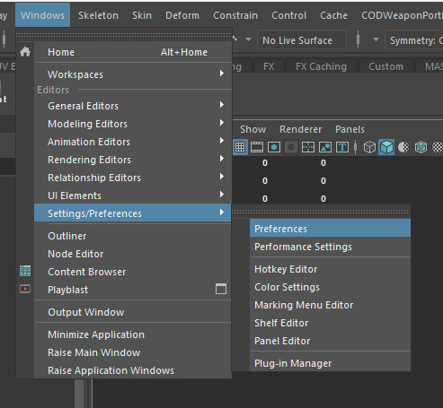

- Click on "Settings".

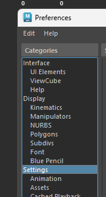

- Select up axis: Z.

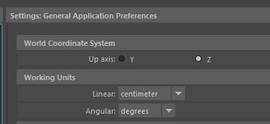

##

### Import settings

How to set up import settings

- Go to the file tab top left, then click on the box next to "Import...".

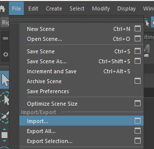

- Look for playback options and select "Override to Match Source" for both "Framerate Import" and "Animation Range".

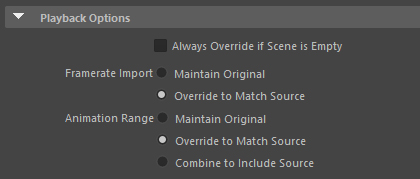

- At the bottom of the window you should see "Namespace options", select "Merge into selected namespace and rename imcoming objects that match".

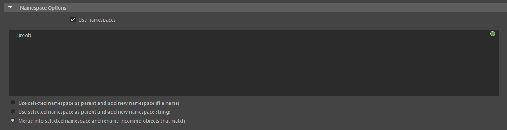

##

### Timeline speed

How to set timeline speed

- Right click your timeline at the bottom of your screen, head to "Playback Speed" > "Real-time".

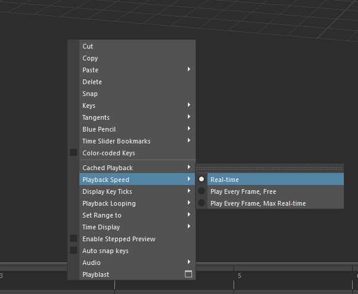

##

### Legacy Default Viewport

How to enable Legacy Default Viewport

- Head to your maya folder located in your douments folder e.g `Documents/maya/2026`, there you should see a file called
"Maya.env" open it with any text editor *(notepad, np++, VS code)*.

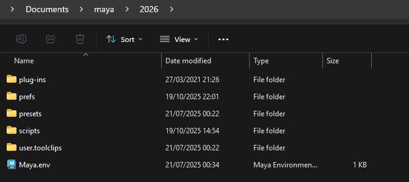

- Once there copy this into to the file and save `MAYA_ENABLE_DEPRECATED_VIEWPORT=1`.

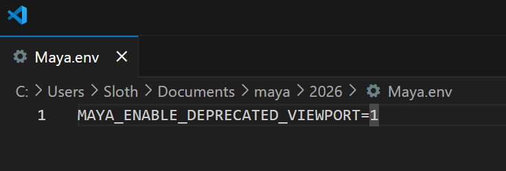

- Restart Maya if you have it open, after restarting you should see a setting called "Legacy Default Viewport" in Renderer.

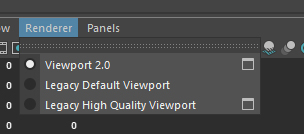

### CODMayaTools (FINISH)

How to install CODMayaTools!

- Download [CODMayaTools](https://github.com/ManyAsset/CODMayaTools/releases) from our github

- Head to your scripts folder located in documents e.g `Documents/maya/2026/scripts`, open the zip and move all files into the scripts folder. If 
you already have a `userSetup.mel` file open it and add `python("import CoDMayaTools");` then save and close.

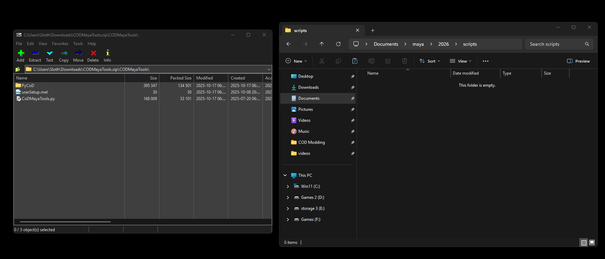

- Restart your Maya if you have it open.

## Setting Up Cast

How to install Cast!

- Download [Cast](https://github.com/dtzxporter/cast/releases) from dtzxporter's github.

- Go to your plug-ins folder e.g `Program Files/Autodesk/Maya2026/bin/plug-ins`, open the zip and move all files into the plug-ins folder.

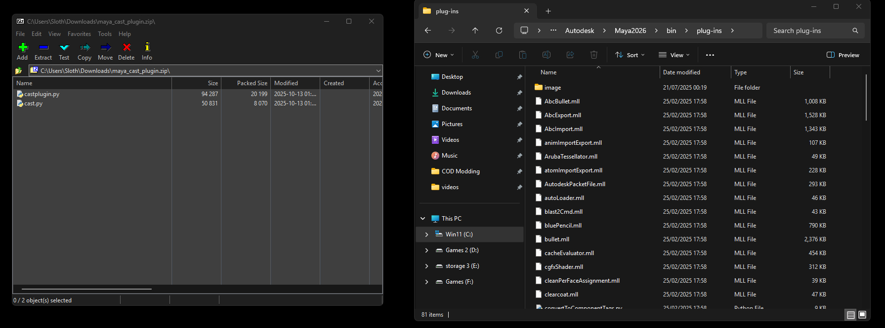

- In Maya go to windows tab at the top, then "Settings/Preferences" > "Plug-in Manager".

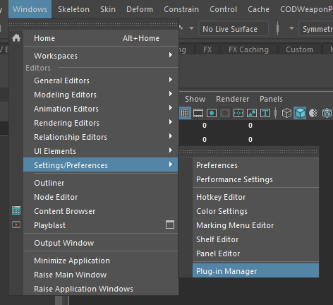

- Search "cast" and tick "castplugin.py".

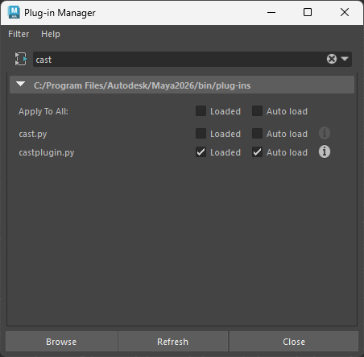

## Setting Up ManyAnims (FINISH)

How to install ManyAnims!

- Download [ManyAnims](https://github.com/ManyAsset/ManyAnims/releases) from ManyAsset github

- Head to your scripts folder located in documents e.g `Documents/maya/2026/scripts`, open the zip go to the 2023+ folder and move the file into the scripts folder. 

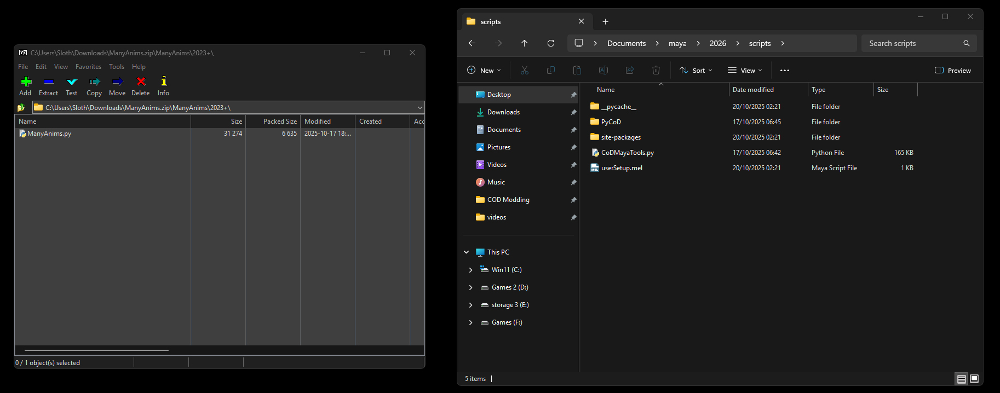

- Open your `userSetup.mel` file and add `python("import ManyAnims");` then save and close.

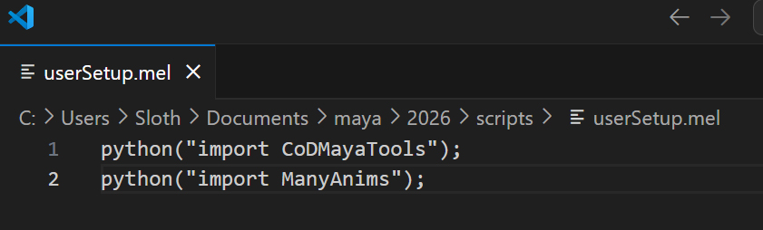

- Restart Maya if you have it open, once maya is open you should see a tab at the top of your screen called "ManyAnims", By default `xanim_export` and `cast` will be enabled.

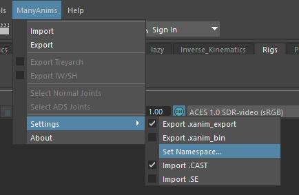

## Using Saluki

How to use Saluki!

- Download [Saluki](https://github.com/echo000/saluki-releases/releases) from saluki-releases github

- Move the exe into its own folder.

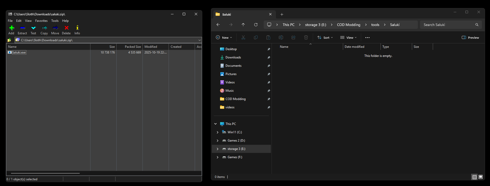

- Run Saluki and head to settings.

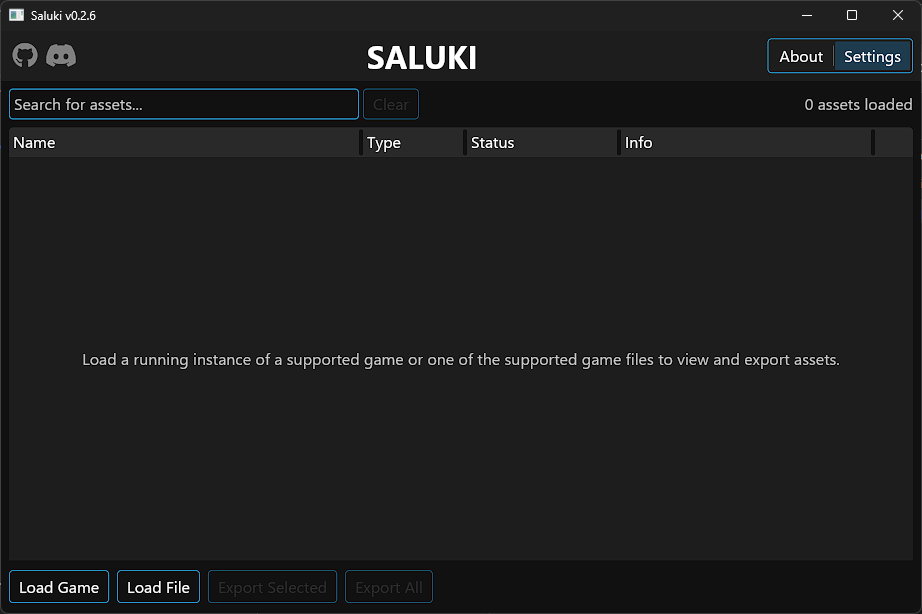

- There you can select what type of assets you want to export.

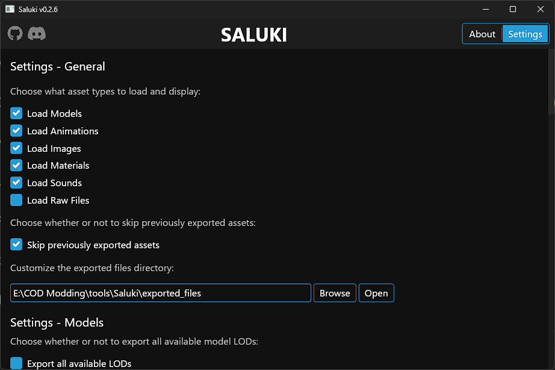

- Settings that I use are exporting all avaliable LODs, image type .TGA and Strip directory from material path. You can check other settings if you wish.

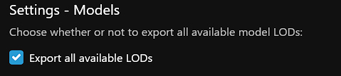

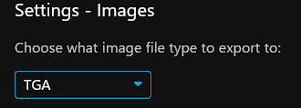

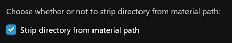

- After you're done with your settings, simply run the game you want to export from and click "Load Game" in Saluki. 

***REMEMBER** if you're porting from a game with ricochet anti-cheat you HAVE to use Cordycep or you will get **banned**!*

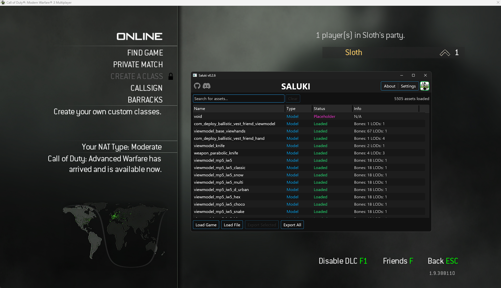

- You can also preview most to all assets with Saluki by pressing the letter "P" on your keyboard.

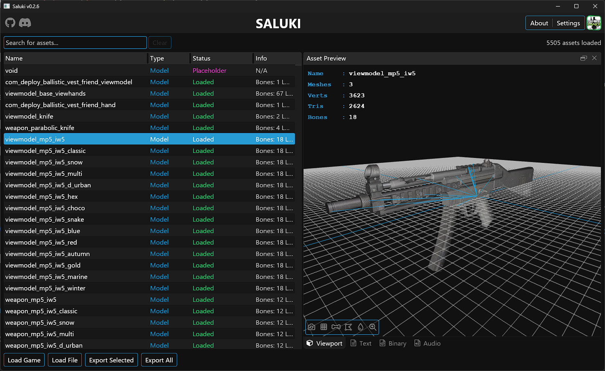

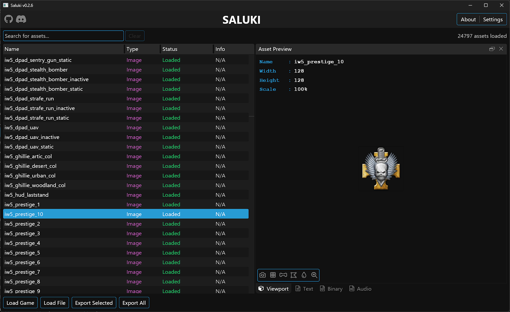

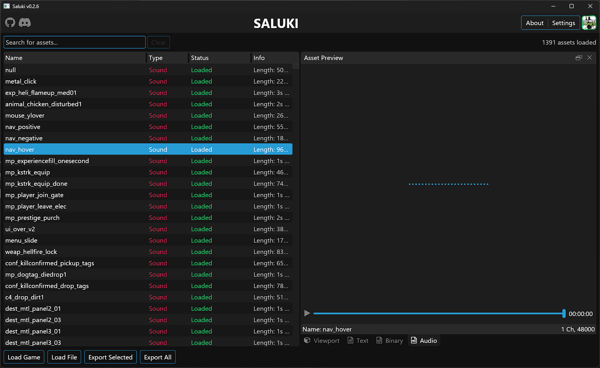

- *Note: for older COD games, if all their assets don't get loaded you will need to load their IWDs with "Load File" and selecting the IWDs.*

- Once you've exported the assets you wanted, head to the `exported_files` folder in root folder of where Saluki is, there you should see the name of the game you exported from and the assets inside.

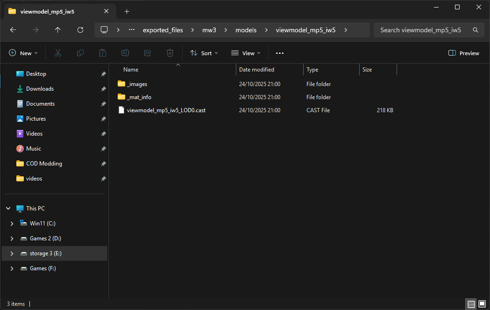

## Using Cordycep

How to use Cordycep!

- Download [Cordycep](https://discord.com/invite/eY2Y5p2PEp) from Dest1yo's discord server under the tools channel.

- Move the files into their own folder.

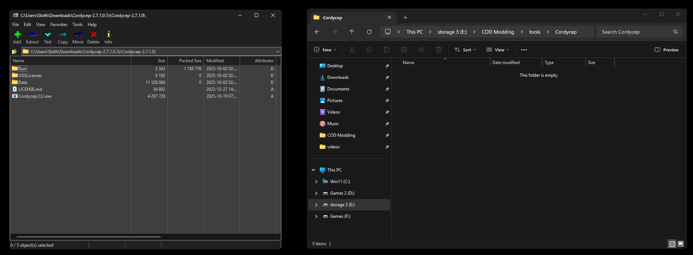

### Cordycep (COD: Online)

- Download [Cordycep (COD: Online)](https://github.com/dest1yo/Cordycep-rs-releases/releasess) from Cordycep-rs-releases github

## Using GameImageUtil (GIU)

How to use GameImageUtil (GIU)!

## Installing COD4:MW ModTools

How to install COD4:MW ModTools!

## Using ManyWeapons

How to use ManyWeapons!

## Using HydraX

How to use HydraX!

